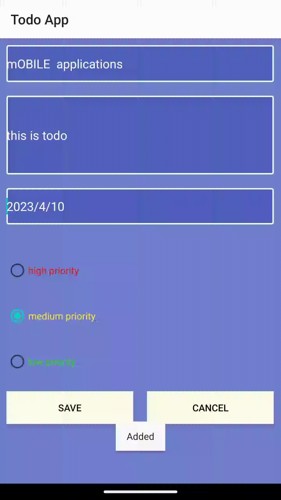
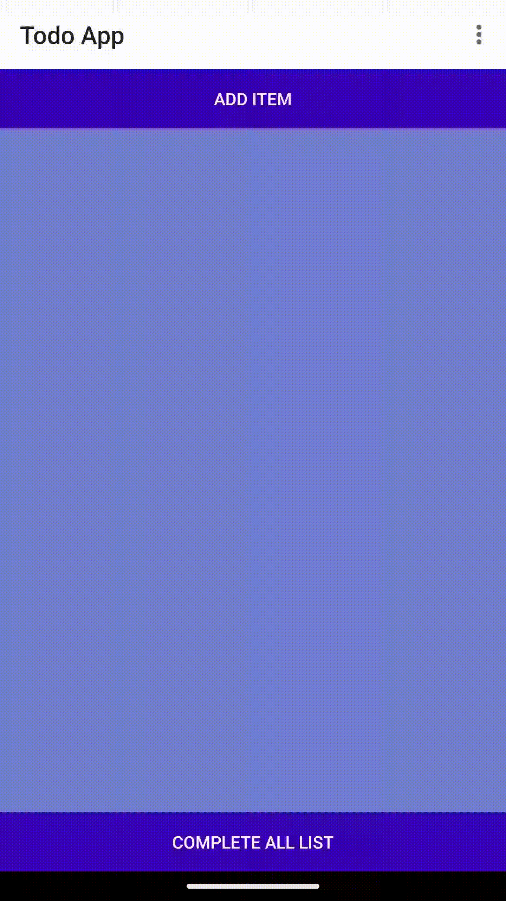
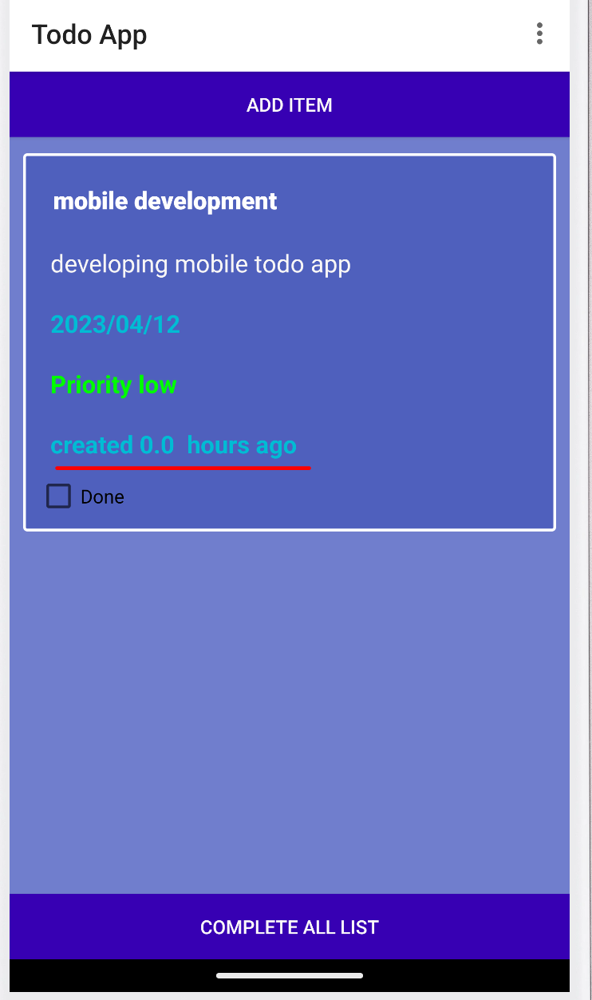
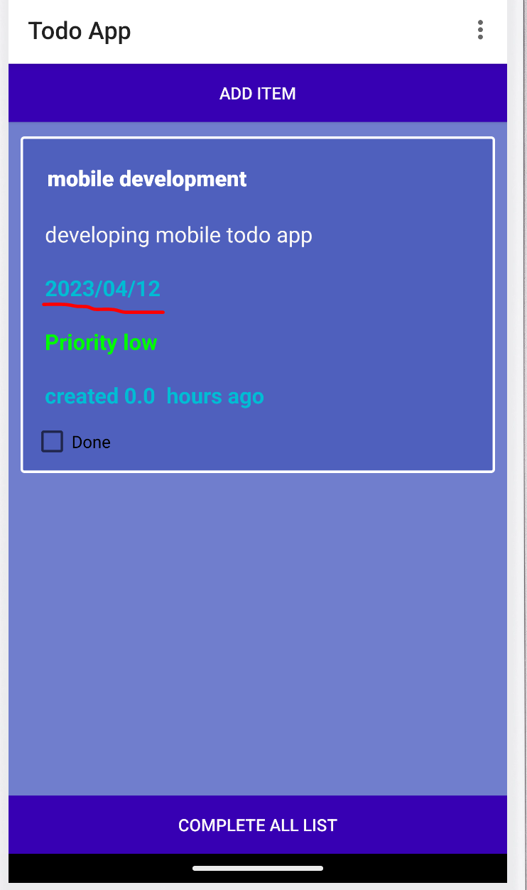

-------------------
Todo Application  |
-------------------
**************************************************************************************
This to-do app helps you organize and prioritize your tasks. With this app, you can: *
**************************************************************************************

* Add new tasks
  Clicking on the “Add” button opens a new activity or window where you can enter details for a new task. 
  This includes fields for adding a title, description, due date, and priority level. Once you have entered 
  all the necessary information, you can click the “Save” button to add the task to your to-do list on the 
  front page.If you change your mind and decide not to add the task, you can click the “Cancel” button to 
  close the window without saving. All fields in this activity are validated and must contain some value 
  before the task can be saved.

* Delete completed tasks
  When you have completed a task on your to-do list, you can mark it as done by clicking on the “Done” button. 
  This will automatically remove the task from your list and mark it as completed. This feature helps you keep 
  your to-do list up-to-date and decluttered, allowing you to focus on the tasks that still need to be done.

* Update existing tasks
  Clicking on a task in your to-do list opens a new activity or window where you can view and edit the details of the task. 
  This includes fields for the title, description, due date, and priority level, all of which will be pre-populated with 
  the existing values for the task. If you make any changes to these fields and click the “Update” button, the task will be 
  updated accordingly. This feature allows you to make changes to your tasks as needed and keep your to-do list up-to-date.

  

* Set task priority 
  When adding or editing a task, you can select its priority level using radio buttons for “High,” “Medium,” and “Low.” 
  If you don’t select a priority level, the task will automatically be assigned a “Low” priority. This feature allows you 
  to prioritize your tasks and focus on the most important ones first.

* View the time a task was created 
  Each task on your to-do list displays the date and time when it was created. This allows you to see 
  when you added the task to your list and keep track of how long it has been on your list.

* View the due date for a task
  Each task on your to-do list also displays its due date, if one has been set. This allows you to
  see when the task needs to be completed and plan accordingly.

* Sort tasks by date
  You can sort your to-do list by the due date of each task in ascending order. This allows you to
  see which tasks are due soonest and plan your time accordingly.

  
* Sort tasks by priority
  You can also sort your to-do list by the priority level of each task, from high to low. This allows
  you to focus on the most important tasks first and ensure that they are completed on time.

* complete all task button
  It also has a ‘Complete All Tasks’ button which clears the entire task list while marking all tasks as completed.

* prerequisites
  If the app is not available on the Google Play Store and is instead hosted on a other website, you’ll need to enable the
  installation of apps from unknown sources on your Android device. This can usually be done in the security settings of 
  your device. However, please be cautious when downloading and installing apps from unknown sources as they may not have 
  been verified for safety and security. It’s always a good idea to research the app and its developer before installing it 
  on your device

To exit the app, click the "Exit" button.

## License

This project is licensed under the MIT License